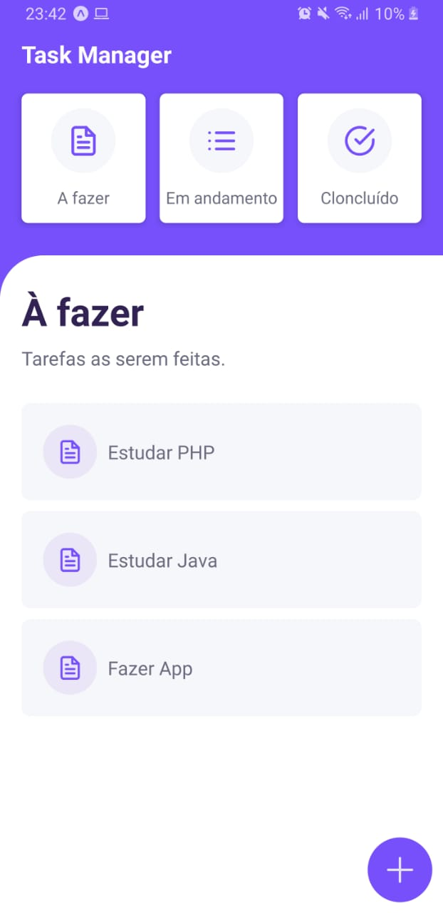
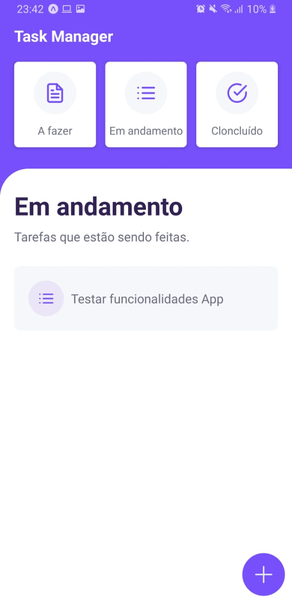
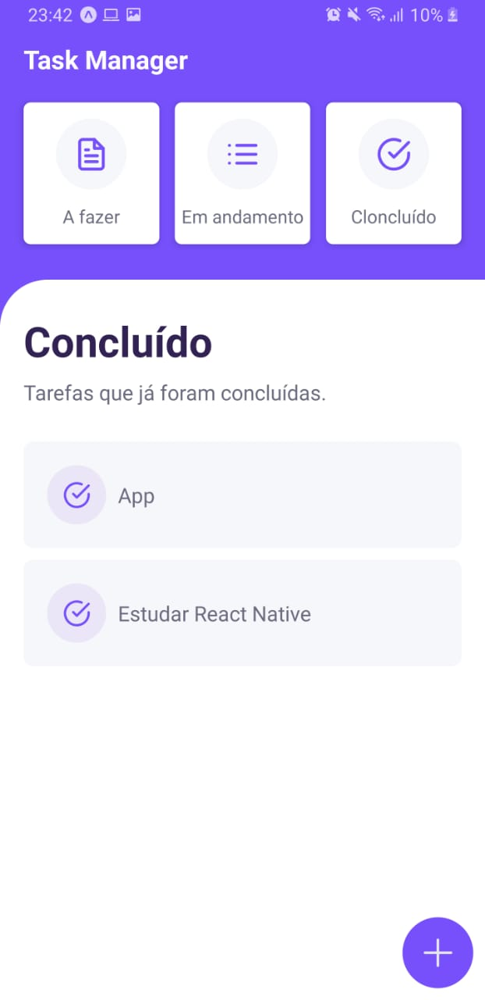

<h1 align="center">
    Task Manager
</h1>

  
  
  
  
  

  <a href="#sobre">Sobre</a>&nbsp;&nbsp;&nbsp;|&nbsp;&nbsp;&nbsp;
  <a href="#tecnologias-utilizadas">Tecnologias</a>&nbsp;&nbsp;&nbsp;|&nbsp;&nbsp;&nbsp;
  <a href="#como-usar">Como usar</a>&nbsp;&nbsp;&nbsp;|&nbsp;&nbsp;&nbsp;
  <a href="#como-contribuir">Como contribuir</a>&nbsp;&nbsp;&nbsp;|&nbsp;&nbsp;&nbsp;
  <a href="#license">Licença</a>

## :bookmark: Sobre

O **Task Manager** surgiu a partir de uma aula de **Desenvolvimento Mobile** que tive na faculdade. A Proposta do aplicativo é gerenciar tarefas **A fazer**, **Em andamento** e **Concluídas** do usuário inspirado no **[Trello](https://trello.com/)**.

## :rocket: Tecnologias Utilizadas

Esse projeto foi desenvolvido com as seguintes tecnologias:

- [TypeScript](https://www.typescriptlang.org/)
- [React Native](https://reactnative.dev/)
- [Expo](https://expo.io/)
- [Firebase](https://firebase.google.com/)

## :iphone: Resultado

  

## :iphone: Screens

  
  
  

## :fire: Pré-requisitos

- [Node.js](https://nodejs.org/en/)
- [NPM](https://www.npmjs.com/) ou [Yarn](https://yarnpkg.com/)
- [Expo](https://expo.io/)

## :zap: Como usar

1. Faça um clone desse repositório: `git clone https://github.com/vitorserrano/task-manager.git`
2. Instale as dependências: `npm install` ou `yarn`
3. Inicie a aplicação: `npm start` ou `yarn start`

## :recycle: Como contribuir

- Faça um fork desse repositório;
- Cria uma branch com a sua feature: `git checkout -b minha-feature`;
- Faça commit das suas alterações: `git commit -m 'feat: Minha nova feature'`;
- Faça push para a sua branch: `git push origin minha-feature`.

## :memo: License

Esse projeto está sob a licença MIT. Veja o arquivo [LICENSE](LICENSE.md) para mais detalhes.

---

<h4 align="center">
    Feito com 💜 by <a href="https://www.linkedin.com/in/vitor-serrano/" target="_blank">Vitor Serrano</a>
</h4>
